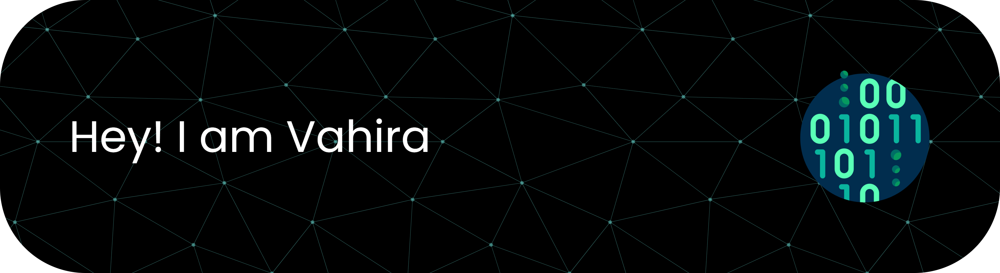

# 💫 About Me:
💻 Software Development & Game Development Student at SMKN 1 Depok 🎯 Passionate about building apps, websites, and interactive games

## 🌐 Socials:
   

## 💻 Tech Stack:
           
## 📊 GitHub Stats:
<!--  
  -->

## Play games with me

<picture>
  <source media="(prefers-color-scheme: dark)" srcset="https://raw.githubusercontent.com/paiipear/paiipear/output/pacman-contribution-graph-dark.svg">
  <source media="(prefers-color-scheme: light)" srcset="https://raw.githubusercontent.com/paiipear/paiipear/output/pacman-contribution-graph.svg">
  
</picture>

###

###

---

